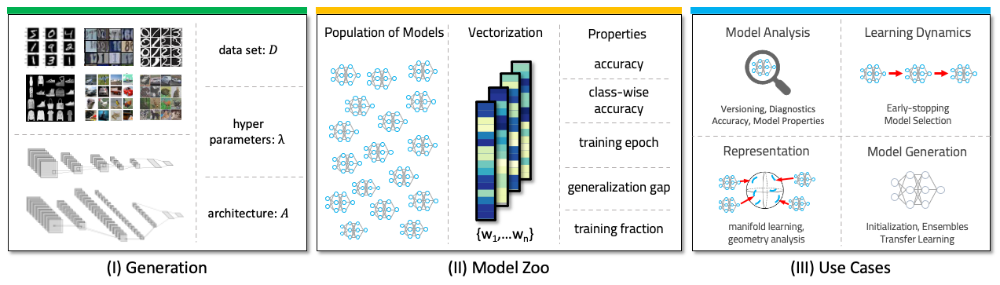

This repository complements the Paper "Model Zoo: A Dataset of Diverse Populations of Neural Network Models". It contains code to recreate, adapt or extend the zoos, links to the zoos, code to load the zoos and reproduce the benchmarks.

# Abstract
In the last years, neural networks have evolved from laboratory environments to the state-of-the-art for many real-world problems. Our hypothesis is that neural network models (i.e., their weights and biases) evolve on unique, smooth trajectories in weight space during training. Following, a population of such neural network models (refereed to as “model zoo”) would form topological structures in weight space. We think that the geometry, curvature and smoothness of these structures contain information about the state of training and can be reveal latent properties of individual models. With such zoos, one could investigate novel approaches for (i) model analysis, (ii) discover unknown learning dynamics, (iii) learn rich representations of such populations, or (iv) exploit the model zoos for generative modelling of neural network weights and biases. Unfortunately, the lack of standardized model zoos and available benchmarks significantly increases the friction for further research about populations of neural networks. With this work, we publish a novel dataset of model zoos containing systematically generated and diverse populations of neural network models for further research. In total the proposed model zoo dataset is based on six image datasets, consist of 24 model zoos with varying hyperparameter combinations are generated and includes 47’360 unique neural network models resulting in over 2’415’360 collected model states. Additionally, to the model zoo data we provide an in-depth analysis of the zoos and provide benchmarks for multiple downstream tasks as mentioned before.

# Data
The model zoo datasets are hosted on Zenodo. Zenodo guarantees at least 20 years of availability, provides searchable metadata and dataset DOIs.  
The zoos of each image dataset are uploaded in individual zenodo repositories, to make them extendable. We provide DOI links below.  
In the Zenodo repositories, we provide `zip` files with the raw model zoos, as well as `.pt` (pytorch) files. 
The `.pt` files contain preprocessed datasets wrapped in our custom dataset class (`code/checkpoints_to_datasets/dataset_base.py`).
The `index_dict.json` contains information on where weights in the vectorized form belong in the original model.  

| Image Dataset | DOI Link to Zoo  |  
| ----------- | ----------- |
| MNIST | https://doi.org/10.5281/zenodo.6632086 |  
| Fashion-MNIST | https://doi.org/10.5281/zenodo.6632104 |   
| SVHN | https://doi.org/10.5281/zenodo.6632120 |  
| USPS | https://doi.org/10.5281/zenodo.6633626 |  
| Cifar10 | https://doi.org/10.5281/zenodo.6620868 |  
| STL10 (raw) | https://doi.org/10.5281/zenodo.6631783 |  
| STL10 (preprocessed) | https://doi.org/10.5281/zenodo.6634138 | 

# Accessibility
We provide a custom pytorch dataset class to load and preprocess the raw model zoos. Code related to the dataset class is in the module `code/checkpoints_to_datasets/`. The class definition can be found under `dataset_base.py`.
The class takes care of loading the model checkpoints and their properties, if necessary vectorizing their weights, and sorting out models with faulty data.
We further provide pre-computed dataset files, with train, test and validation datasets.
To further simplify access to the datasets, a jupyter notebook `code/load_dataset.ipynb` contains examples of loading preprocessed or raw datasets and explores their properties.  A conda `environmnent.yml` to create a working conda environment can be found in `code/`.

# Zoo Generation
The scripts to generate the model zoos can be found under `code/zoo_generators/`. 
With these scripts, the zoos can be rectreated, adapted or extended. 
The class definition for the models in the zoo is contained in `code/model_definitions/def_net.py`. 
We use [ray tune](#https://docs.ray.io/en/latest/tune/index.html) in version 1.8.0 to train populations. The `tune.trainable` class wrapper around the model is in `code/model_definitions/def_NN_experiment.py`. We provide a conda `environmnent.yml` to recreate the exact package versions.

# Benchmark Results
A notebook with code to replicate the benchmark numbers from the paper can be found in `code/benchmark_results.ipynb`. The benchmark classes are located in `code/model_definitions/def_downstream_module.py` and `code/model_definitions/def_baseline_models.py`.  

# License
The model zoos are licensed under the Creative Commons Attribution 4.0 International license (CC-BY 4.0).
